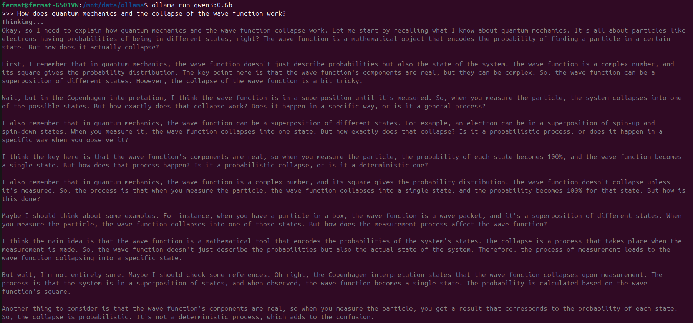
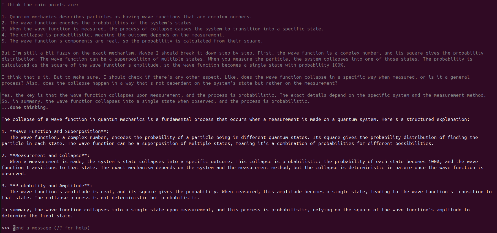
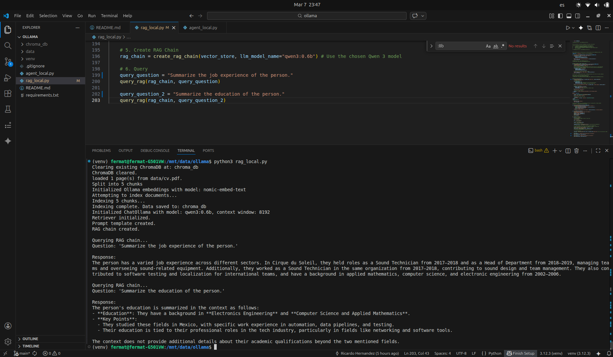
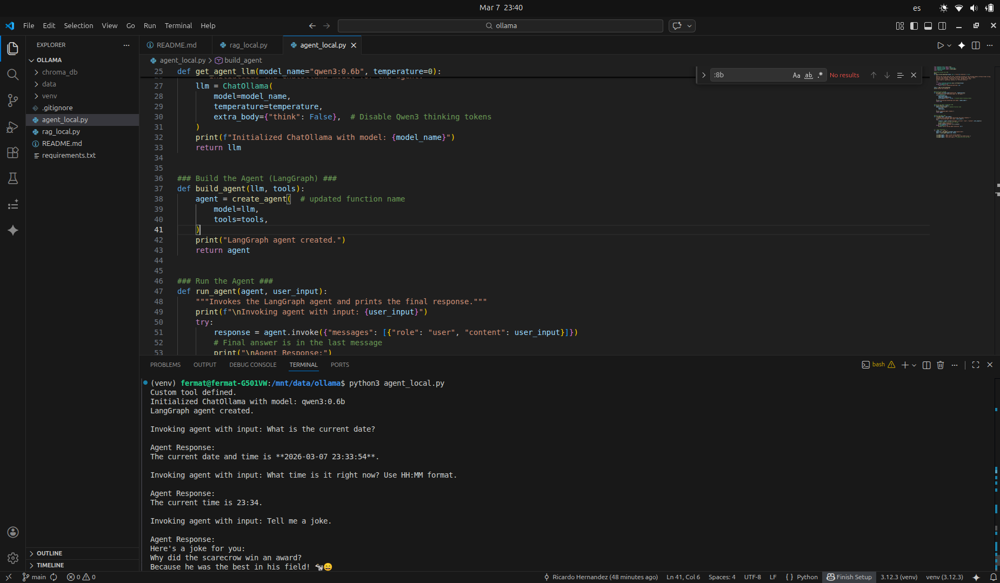

# localLLM
Local LLM (ollama) with RAG (updated code for 2026-03)

Based on https://www.freecodecamp.org/news/build-a-local-ai/

Set-up:
- memory         16GiB System memory
- processor      Intel(R) Core(TM) i7-6700HQ CPU @ 2.60GHz
- gpu            GM107M [GeForce GTX 960M]

Model:           
- qwen3:0.6b

## Ollama on CLI

## rag_local.py

## agent_local.py
